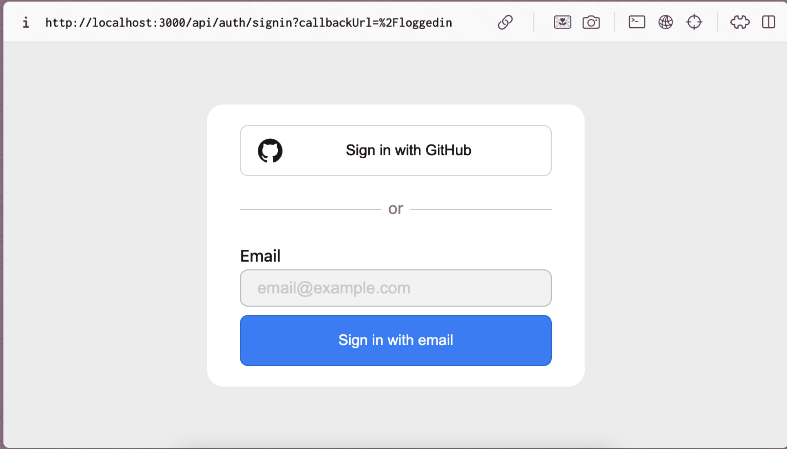

# HOMEWORK:

## 1.1

3 - абзаци різних кольорів (LOREM IPSUM)
_ (різний шрифт)
_ поставити абзац
5 посилань в кожному абзаці на різні слова
кожен з абзаців розділити лінією
Загаловок кожному абзацу h1 | h2 | h3

## 1.2

### Докорегувати варіант із заняття до готового прикладу (врахуйте кольори розташування, межі кнопок діві, для розміщення використовуйте display: flex, та можете спробувати переробити кнопики на div)

